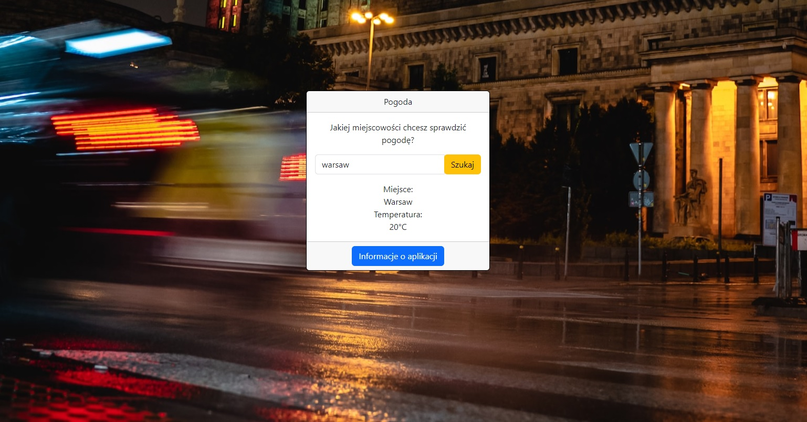

# :desktop_computer: Weather

The application displays information about the name and temperature of the location entered by the user. Then, based on that location, the application may display a characteristic background, but not all cities may be displayed due to limited resources of the database used. To achieve this, the application uses WeatherAPI and Unsplash to display current weather information and to show appropriate backgrounds.

## :framed_picture: Screenshots

## :joystick: Demo

https://kamilkeder.github.io/Weather/

## :e-mail: Feedback

If you have any feedback, please reach out to me at kontaktkkeder@gmail.com
